# Pokémon Unbound auf Deutsch – German Patch (Fan-Übersetzung)

A community-driven German (Deutsch) localization of Pokémon Unbound — with official Pokémon terminology, lore-aware wording, and hands-on in-game QA.

> **Beta v0.1 erscheint am 08.10.2026.** Download, Patch-Anleitung und alle Infos: siehe unten. · **Discord:** https://discord.gg/fSkhHppgcv

## About

This repository documents an ongoing German Pokémon Unbound translation/localization project (Deutsch / Deutsche Übersetzung). Pokémon Unbound is a Pokémon FireRed ROM hack built on the CFRU ecosystem. The goal is a consistent German localization with official Pokémon terminology, lore-aware wording, in-game QA, and safe patch-only distribution.

The public repository currently contains documentation, contribution guidelines, issue templates, curated screenshots, and QA coordination material. It does not contain a playable ROM, a patched ROM, or a public patch release.

## Status

**Beta v0.1 – öffentliche Test-Version ab 08.10.2026.** Patch-only (keine ROM), zum Spielen, Testen und Mithelfen.

## Beta v0.1

**Release: 08.10.2026** – eine öffentliche Beta zum Testen, **keine fertige Übersetzung**.

- **Umfang:** rund 17.000 Texteinträge übersetzt, ca. 98 % des sichtbaren Spieltexts auf Deutsch (maschinell gemessen); Story, NPCs, Kämpfe, Menüs, Items, Attacken, Fähigkeiten, Missionsbuch, deutscher Titelbildschirm.
- **Download:** erscheint am **08.10.** auf der Release-Seite.
- **Was du brauchst:** deine eigene, legal erworbene Basis-ROM. Wir verteilen nur einen `.bps`-Patch, keine ROM.
- **So geht's:** [Patch-Anleitung](docs/PATCH_ANLEITUNG.md)
- **Was ist neu, wie wir gearbeitet haben, wie es weitergeht:** [Release Notes v0.1](docs/RELEASE_NOTES_v0.1.md)

Es ist eine Beta: Rechnet mit einzelnen englischen Grafiken (z. B. Typ-Symbole), holprigen Formulierungen und Stellen, die noch nicht von Menschen gelesen wurden. Genau dabei hilft uns euer Feedback – Fehler gerne über das Formular [Übersetzungsfehler melden](https://github.com/pokemon-unbound-de/pokemon-unbound-de/issues/new?template=01-uebersetzungsfehler.yml) oder im [Discord](https://discord.gg/fSkhHppgcv).

## Release-Ankündigung

Am **08.10.2026** erscheint die erste öffentliche Beta der deutschen Pokémon-Unbound-Übersetzung.

- **Wie wir gearbeitet haben:** KI-gestützte Übersetzung in Wellen, abgeglichen mit einem Glossar offizieller Pokémon-Begriffe. Jede Welle muss durch automatische Prüfungen (Steuercodes/Namen, Textbreite am echten Bildschirm, Terminologie, Zeiger-Zuordnung, Namenstabellen). Ein Test-Bot im Emulator hat 368 Karten, rund 290 NPCs mit Trainerkämpfen, 200 Schilder sowie Tasche, Pokédex, PC und Missionsbuch durchlaufen. Jeder gefundene Fehler wurde als Fehlerklasse in eine neue automatische Prüfung übersetzt.
- **Wie es weitergeht:** Menschen machen es menschlich. Über Community-Pakete (Englisch + KI-Deutsch nebeneinander), den Discord und Tests verbessern wir Formulierungen Schritt für Schritt.
- **Warum GBA-Übersetzungen knifflig sind:** Texte werden über Zeiger gefunden; längere deutsche Texte müssen verschoben und alle Zeiger umgebogen werden. Dazu kommen feste Textbreiten und Texte, die als Grafik gezeichnet sind.
- **Danke:** Skeli und dem Unbound-Team für Pokémon Unbound, NevioCore für Projektleitung und Tests, und der Community.

Alle Details: [Release Notes v0.1](docs/RELEASE_NOTES_v0.1.md) · Mitmachen: https://discord.gg/fSkhHppgcv

## What This Repository Is

This repository documents the German localization process, contributor workflow, terminology decisions, QA notes, and safe tooling around the project.

The work so far has been AI-assisted and manually reviewed in batches. Human QA is still essential: we especially need help with lore consistency, terminology, natural German wording, render issues, textbox fit, and in-game testing.

## Help Wanted

This project needs human review. The most useful contributions right now are:

- [Screenshot QA](https://github.com/pokemon-unbound-de/pokemon-unbound-de/issues/1): check German wording in real in-game context and compare screenshots against expected phrasing.
- [Terminology / Lore](https://github.com/pokemon-unbound-de/pokemon-unbound-de/issues/2): review official Pokémon terminology, names, and lore consistency.
- [Rendering QA](https://github.com/pokemon-unbound-de/pokemon-unbound-de/issues/3): report textbox overflow, broken line breaks, clipping, or control-code issues.
- [Patch-only Release Policy](https://github.com/pokemon-unbound-de/pokemon-unbound-de/issues/4): help shape a safe no-ROM release checklist for later.
- Testing early-game and story-heavy scenes once a safe local setup exists.

Not sure where to start? Reviewing one screenshot or reporting one wording issue is already useful.

Please do not upload ROMs, saves, states, BIOS files, or commercial assets.

## What This Repository Is Not

This repository does not provide ROMs, BIOS files, save states, commercial assets, keys, credentials, or private files.

## Features

- German localization tracking
- Public screenshot and wording QA workflow
- Terminology, lore, and textbox review process
- Terminology and style documentation
- Contributor-facing issue and review process

## Screenshots

Screenshots are from the local development build and are shown only to demonstrate German localization progress. No ROMs are included in this repository.

  
  

  
  

  
  

  
  

  
  

  
  

  
  

  
  

  
  

  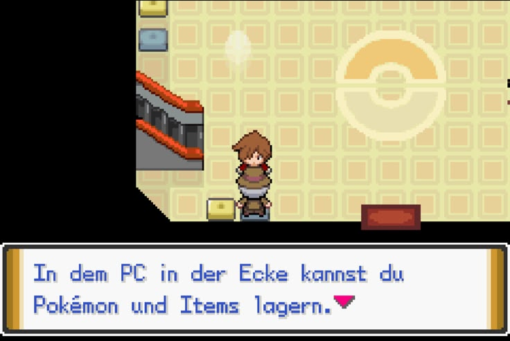
  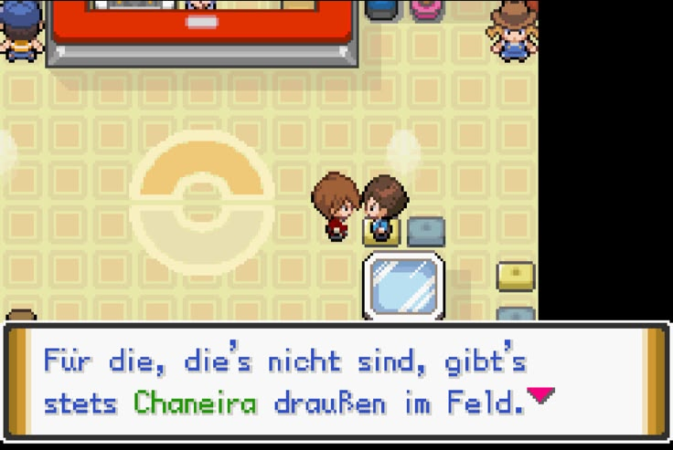

  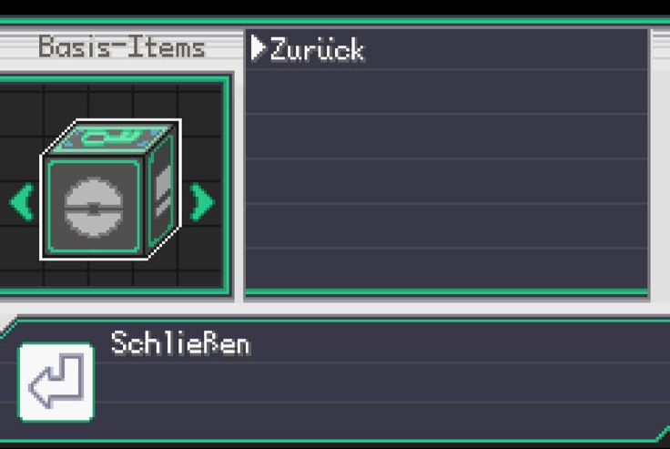
  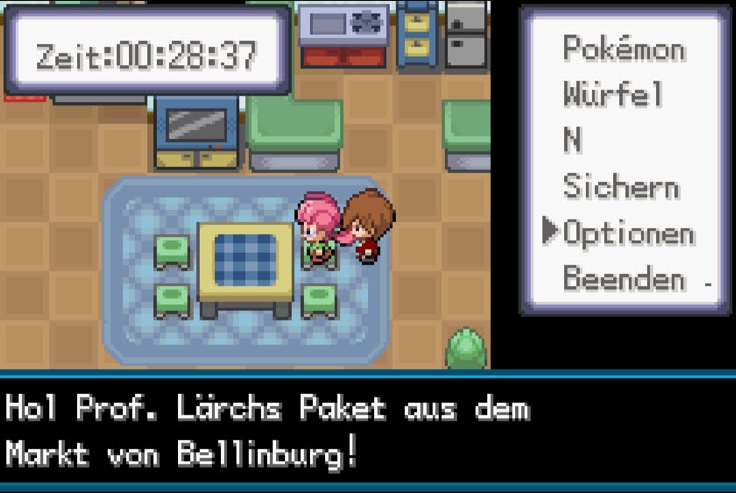

  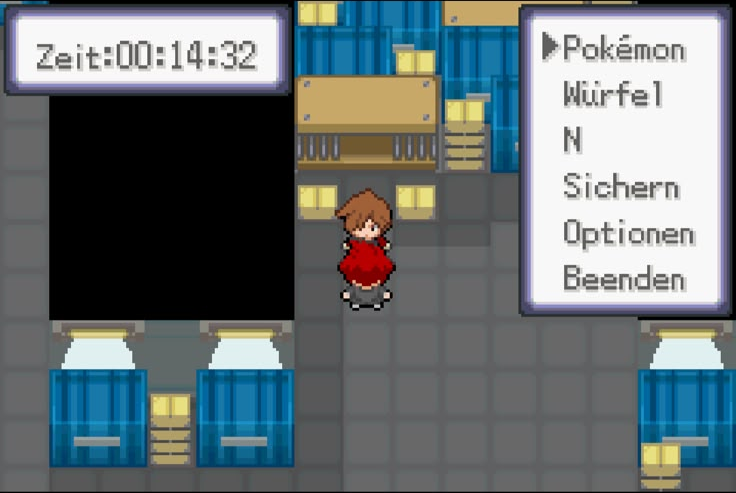
  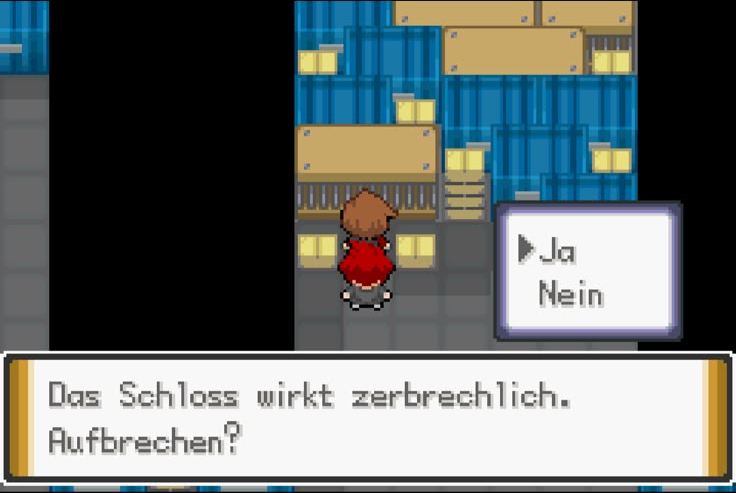

  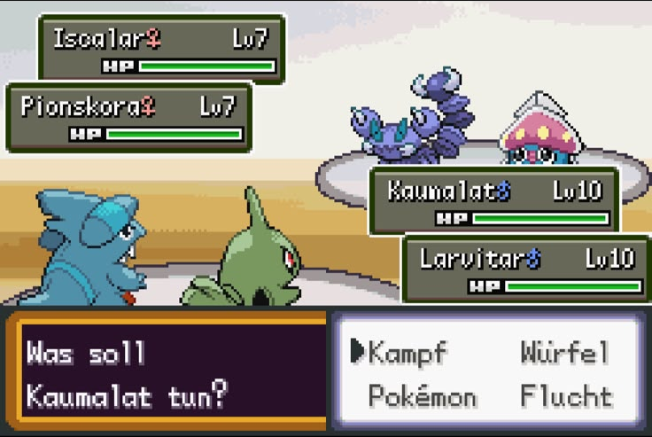
  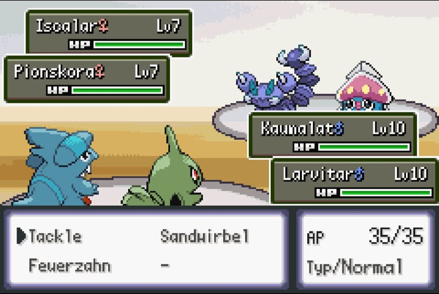

  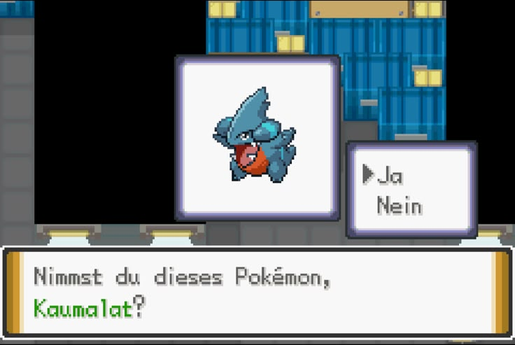
  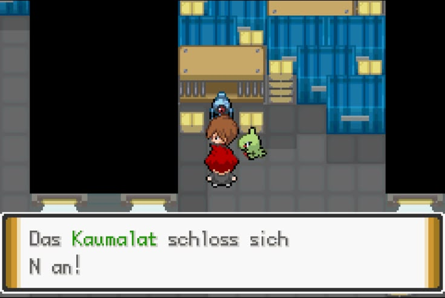

  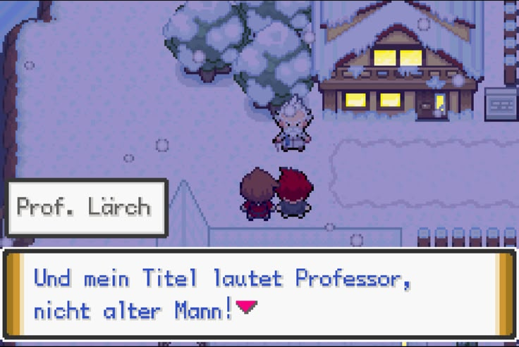
  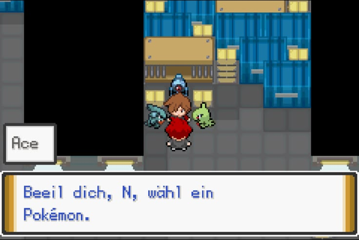

  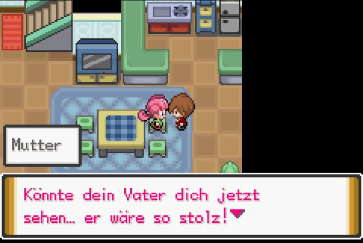

### Beta v0.1 — Eindrücke

Aus der aktuellen Beta-v0.1-Entwicklungsversion (früher Spielstand, keine Spoiler).

  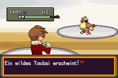
  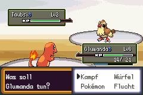

  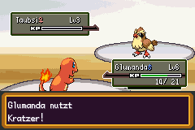
  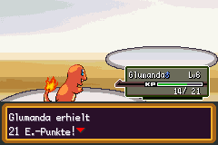

  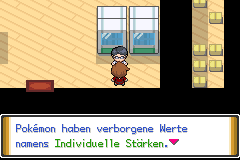
  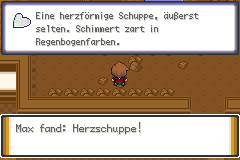

  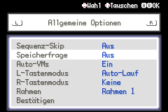
  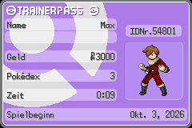

**Story**

  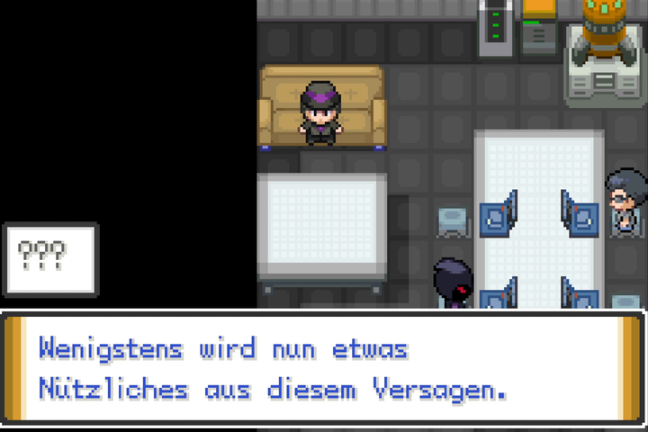
  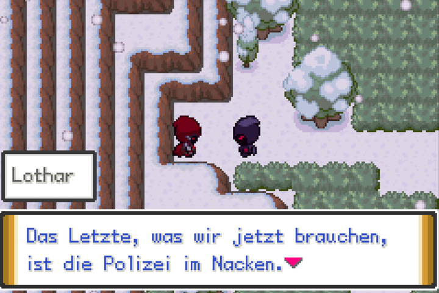
  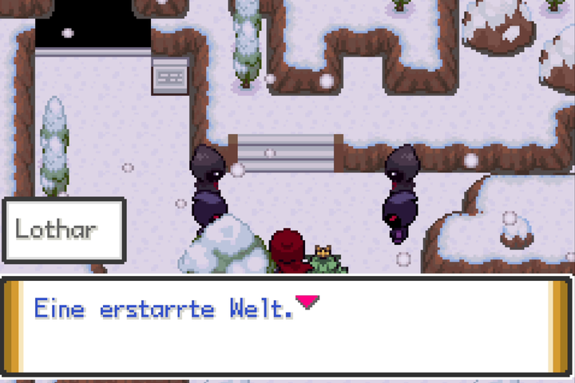
  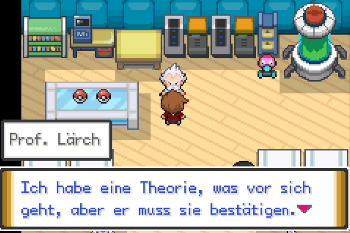

## Installation

No ROM is provided. From **08.10.2026** the Beta v0.1 is available as a `.bps` patch (patch-only).

Users must provide their own legal base ROM and apply the published patch locally. Checksums and step-by-step instructions are in the patch guide.

Für die Beta v0.1: siehe [docs/PATCH_ANLEITUNG.md](docs/PATCH_ANLEITUNG.md).

## FAQ

**Was ist das? / What is this?**
Ein community-getriebenes Fan-Projekt, das Pokémon Unbound (ein Pokémon-FireRed-ROM-Hack auf CFRU-Basis) ins Deutsche übersetzt/lokalisiert — mit offizieller Pokémon-Terminologie, lore-treuer Formulierung und Ingame-QA. This repository is documentation and QA coordination for a German (Deutsch) Pokémon Unbound translation.

**Gibt es einen Download / einen Patch? / Where is the download?**
Ab dem **08.10.2026** gibt es die Beta v0.1 als `.bps`-Patch auf der Release-Seite. Dieses Repository enthält **keine ROMs**: Ihr bringt eure eigene, legal erworbene Basis-ROM mit und wendet den Patch lokal an – siehe [Patch-Anleitung](docs/PATCH_ANLEITUNG.md).

**Welche Version wird unterstützt? / Which version is supported?**
Diese Übersetzung basiert vermutlich auf **Pokémon Unbound v1.0.1** (laut Copyright-Splash-Grafik im ROM, 2016–2020 Skeli Games) — **nicht** der aktuellen finalen Version **v2.1.1.1** (seit November 2022). Grundlage ist Pokémon Unbound auf Basis von Pokémon FireRed (BPRE) im CFRU-Ökosystem; ein Patch würde gegen einen definierten Basis-ROM mit veröffentlichter Prüfsumme (MD5) erstellt, damit die Anwendung reproduzierbar ist. Ein allgemeiner Patch erscheint erst nach Abschluss der Übersetzung; danach ist eine Portierung auf die neueste Version geplant.
*This translation is likely based on **Pokémon Unbound v1.0.1** (per the in-ROM copyright-splash graphic, 2016–2020 Skeli Games) — not the current final version **v2.1.1.1** (since November 2022). A general patch will only be released once the translation is complete, followed by a port to the latest version.*

**Wie kann ich helfen? / How can I contribute?**
Menschliche QA ist entscheidend: Screenshot-QA, Terminologie/Lore, natürliche deutsche Formulierung, Render-/Textbox-Probleme und Ingame-Tests. Siehe die offenen [Issues](https://github.com/pokemon-unbound-de/pokemon-unbound-de/issues) — schon eine einzelne Formulierungsmeldung hilft.

**Ist das legal? / Is this legal?**
Dies ist eine inoffizielle Fan-Übersetzung, nicht mit den Rechteinhabern verbunden oder von ihnen unterstützt. Es werden **keine ROMs, BIOS-Dateien, Savestates oder kommerziellen Assets** verteilt. Pokémon und Pokémon Unbound gehören ihren jeweiligen Rechteinhabern.

## Contributing

See [CONTRIBUTING.md](CONTRIBUTING.md) and [docs/CONTRIBUTOR_QUICKSTART.md](docs/CONTRIBUTOR_QUICKSTART.md). Issues and pull requests are welcome for translation errors, terminology/lore concerns, render or textbox problems, and curated documentation/tooling improvements. Contributions should avoid broad rewrites and must include enough context for localization and technical review.

## Legal

Pokémon and Pokémon Unbound are owned by their respective rights holders. This project is an unofficial fan translation / fan localization workflow and is not affiliated with or endorsed by those rights holders. It does not distribute ROMs or commercial assets.

Licensing and IP notes: [docs/LICENSING.md](docs/LICENSING.md)

## Roadmap

See [ROADMAP.md](ROADMAP.md) for the current public roadmap.

## Credits / Contact

Maintained by the project owner. Contributions and QA reports are welcome via GitHub Issues for translation reports, terminology/lore concerns, render problems, and contributor coordination.
