# Pokémon Unbound DE

A community-driven German (Deutsch) localization of Pokémon Unbound — a full translation with official Pokémon terminology, lore-aware wording, and hands-on in-game QA.

## About

This repository documents an ongoing German Pokémon Unbound translation/localization project (Deutsch / Deutsche Übersetzung). Pokémon Unbound is a Pokémon FireRed ROM hack built on the CFRU ecosystem. The goal is a consistent German localization with official Pokémon terminology, lore-aware wording, in-game QA, and safe patch-only distribution.

The public repository currently contains documentation, contribution guidelines, issue templates, curated screenshots, and QA coordination material. It does not contain a playable ROM, a patched ROM, or a public patch release.

## Status

Alpha / work in progress.

Current public status:

- Documentation and QA workflow are public.
- A growing set of curated screenshots is available for review.
- A patch-only release policy is not finalized yet.

## What This Repository Is

This repository documents the German localization process, contributor workflow, terminology decisions, QA notes, and safe tooling around the project.

The work so far has been AI-assisted and manually reviewed in batches. Human QA is still essential: we especially need help with lore consistency, terminology, natural German wording, render issues, textbox fit, and in-game testing.

## Help Wanted

This project needs human review. The most useful contributions right now are:

- [Screenshot QA](https://github.com/prm9j785cn-design/pokemon-unbound-de/issues/1): check German wording in real in-game context and compare screenshots against expected phrasing.
- [Terminology / Lore](https://github.com/prm9j785cn-design/pokemon-unbound-de/issues/2): review official Pokémon terminology, names, and lore consistency.
- [Rendering QA](https://github.com/prm9j785cn-design/pokemon-unbound-de/issues/3): report textbox overflow, broken line breaks, clipping, or control-code issues.
- [Patch-only Release Policy](https://github.com/prm9j785cn-design/pokemon-unbound-de/issues/4): help shape a safe no-ROM release checklist for later.
- Testing early-game and story-heavy scenes once a safe local setup exists.

Not sure where to start? Reviewing one screenshot or reporting one wording issue is already useful.

Please do not upload ROMs, saves, states, BIOS files, or commercial assets.

## What This Repository Is Not

This repository does not provide ROMs, BIOS files, save states, commercial assets, keys, credentials, or private files.

## Features

- German localization tracking
- Public screenshot and wording QA workflow
- Terminology, lore, and textbox review process
- Terminology and style documentation
- Contributor-facing issue and review process

## Screenshots

Screenshots are from the local development build and are shown only to demonstrate German localization progress. No ROMs are included in this repository.

  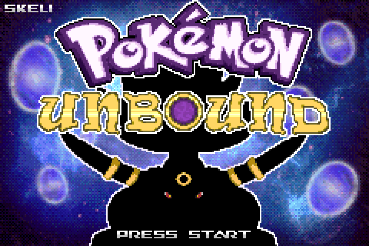
  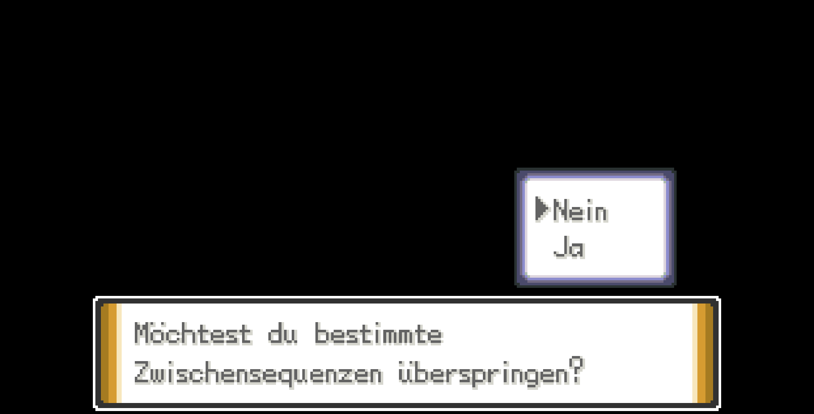

  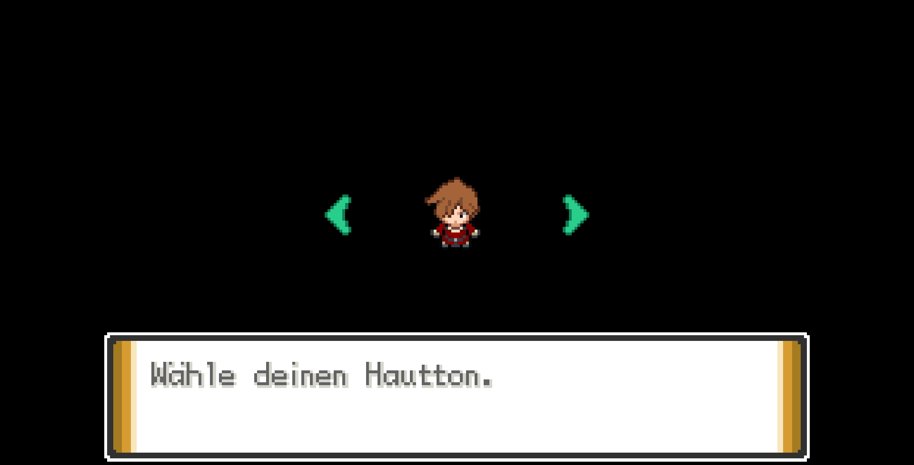
  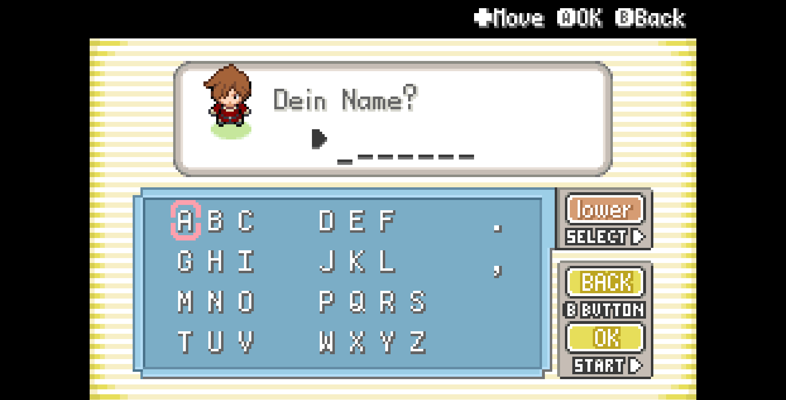

  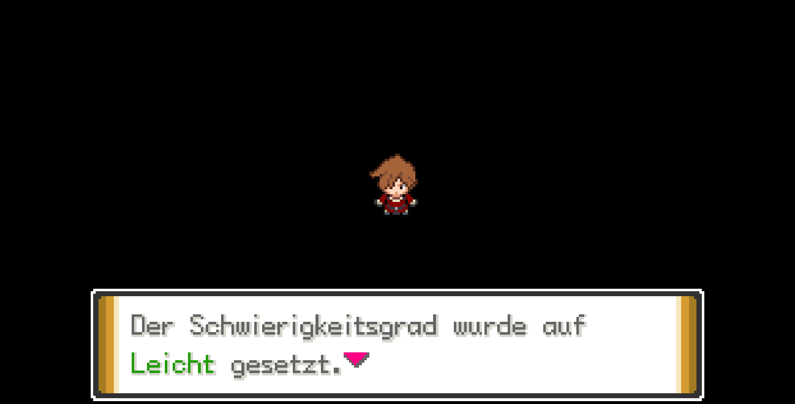
  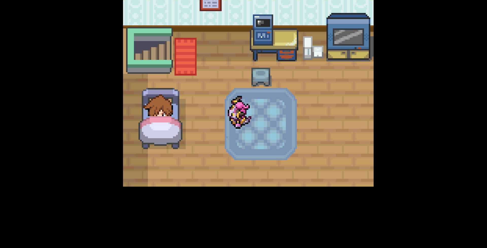

  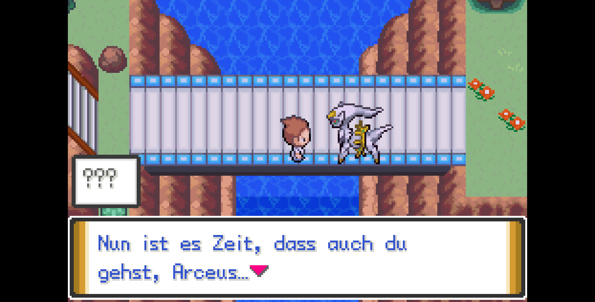
  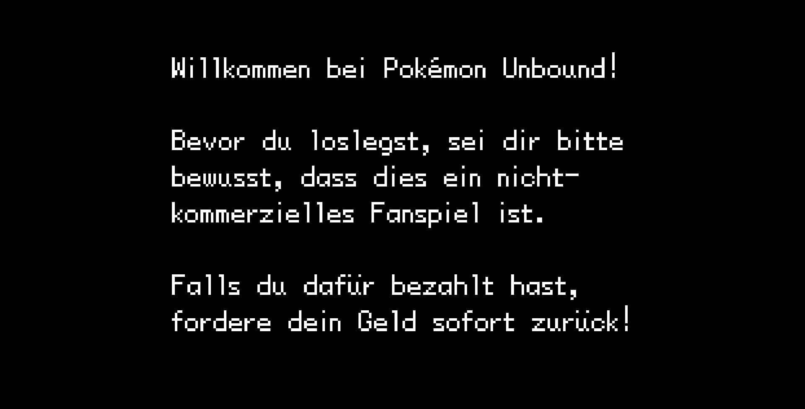

  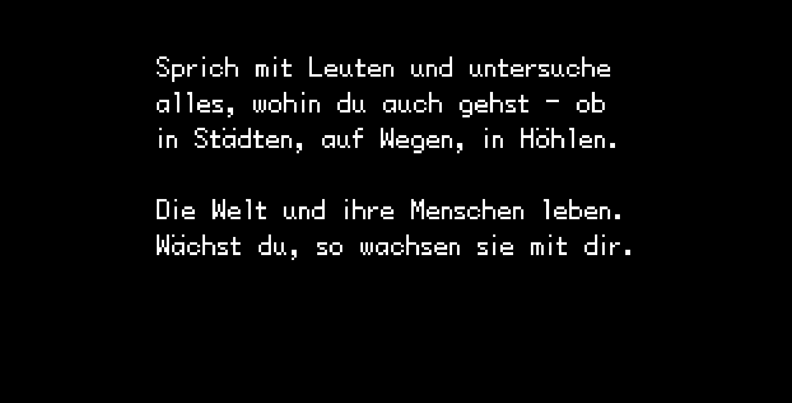
  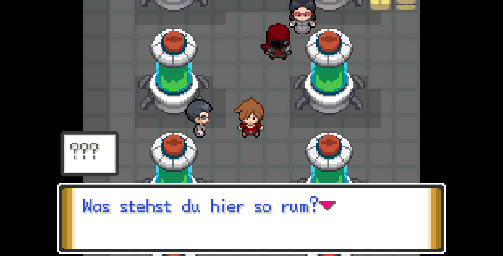

  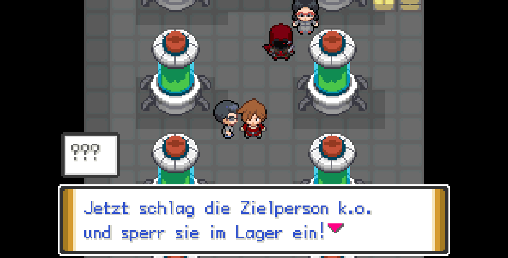
  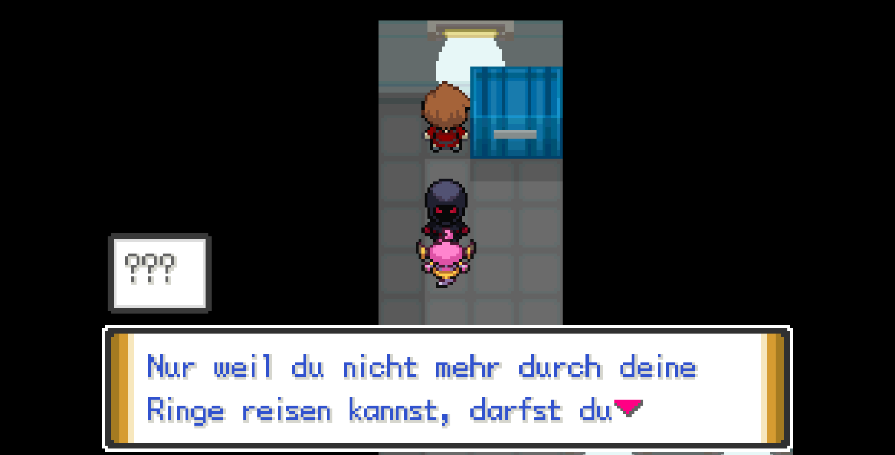

  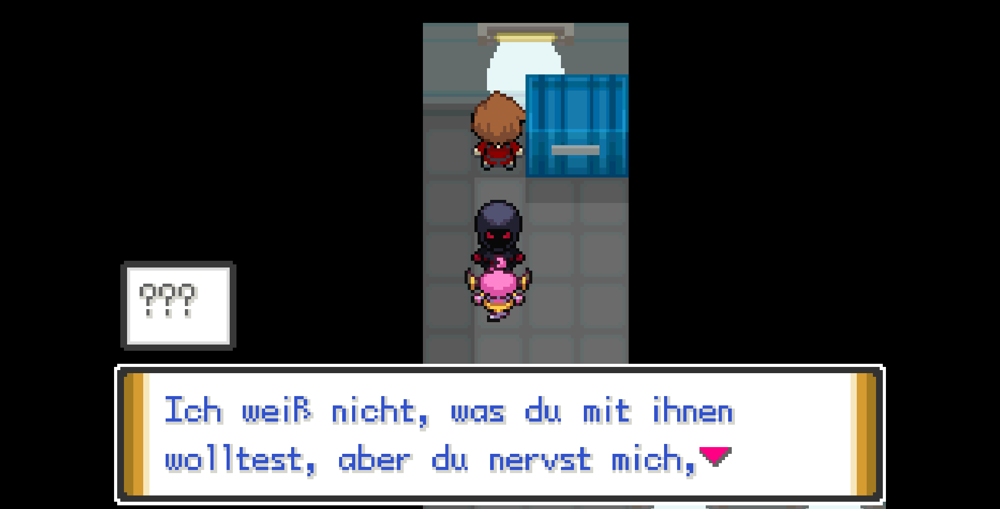
  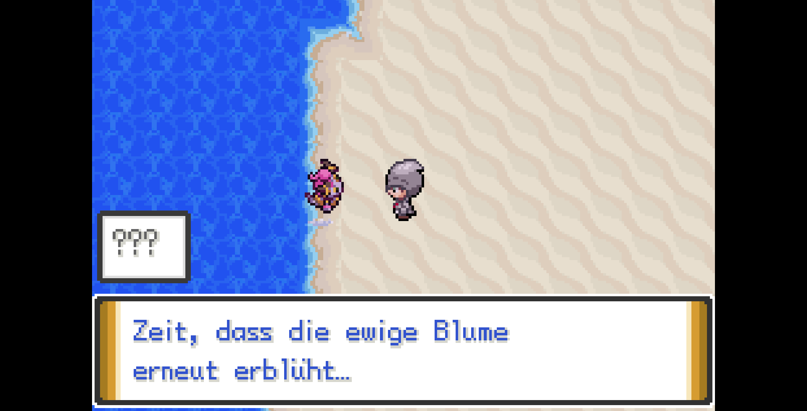

  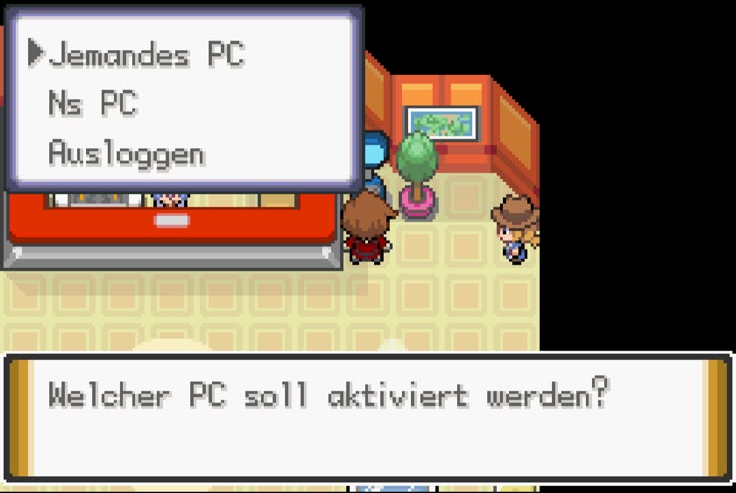
  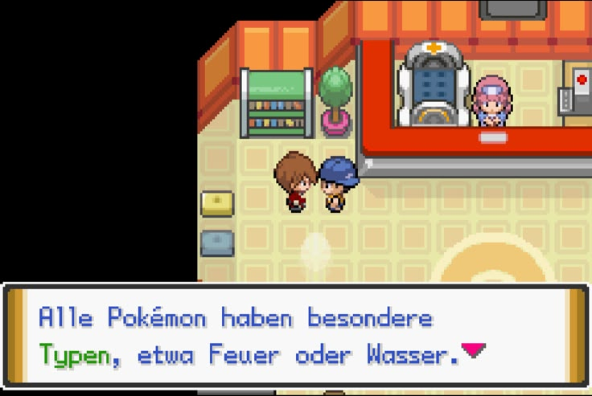

  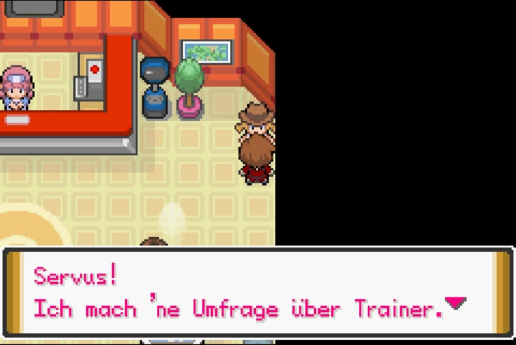
  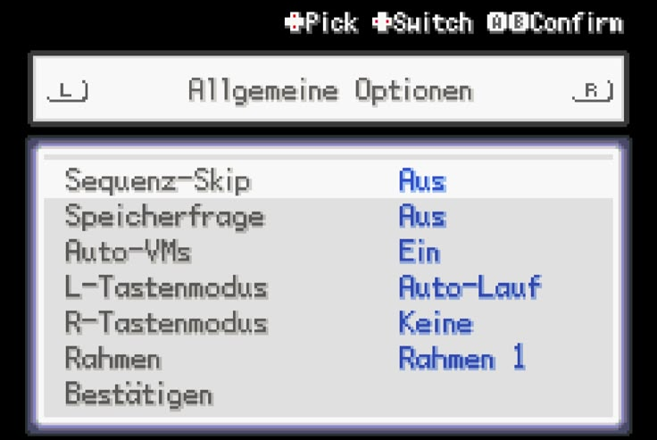

## Installation

No ROM is provided, and there is no public patch release yet.

If a patch release is explicitly approved later, users must provide their own legal base ROM and apply the published patch locally. Checksums and patch instructions should be included with that release.

## Contributing

See [CONTRIBUTING.md](CONTRIBUTING.md) and [docs/CONTRIBUTOR_QUICKSTART.md](docs/CONTRIBUTOR_QUICKSTART.md). Issues and pull requests are welcome for translation errors, terminology/lore concerns, render or textbox problems, and curated documentation/tooling improvements. Contributions should avoid broad rewrites and must include enough context for localization and technical review.

## Legal

Pokémon and Pokémon Unbound are owned by their respective rights holders. This project is an unofficial fan translation / fan localization workflow and is not affiliated with or endorsed by those rights holders. It does not distribute ROMs or commercial assets.

Licensing and IP notes: [docs/LICENSING.md](docs/LICENSING.md)

## Roadmap

See [ROADMAP.md](ROADMAP.md) for the current public roadmap.

## Credits / Contact

Maintained by the project owner. Contributions and QA reports are welcome via GitHub Issues for translation reports, terminology/lore concerns, render problems, and contributor coordination.
