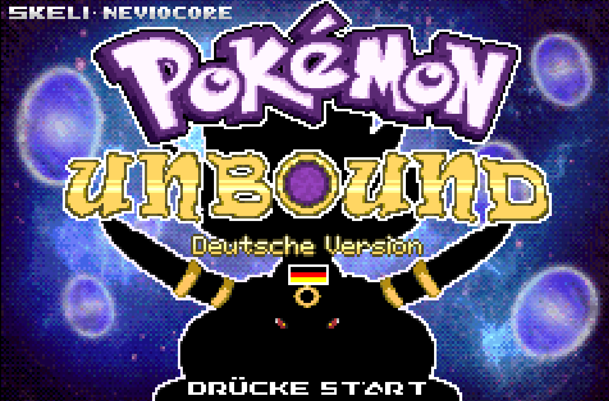
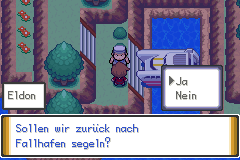
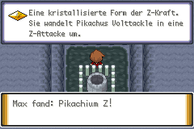

# Pokémon Unbound auf Deutsch – German Patch (Fan-Übersetzung)

**🎉 Die Beta v0.1 ist da!** Spiel Pokémon Unbound auf Deutsch – mit den offiziellen deutschen Pokémon-Begriffen.

·  👉 **[Download: Beta v0.1](https://github.com/pokemon-unbound-de/pokemon-unbound-de/releases/tag/v0.1-beta)** 
·  📖 **[Patch-Anleitung](docs/PATCH_ANLEITUNG.md)** 
·  💬 **[Discord](https://discord.gg/fSkhHppgcv)** 
·  🇩🇪 **[Reddit](https://www.reddit.com/r/PokemonUnboundDE/)**

*English below.*

  
  

## In 3 Schritten spielen

1. **Patch laden:** Auf der [Release-Seite](https://github.com/pokemon-unbound-de/pokemon-unbound-de/releases/tag/v0.1-beta) **eine** der beiden `.bps`-Dateien holen – passend zu deiner ROM:
   - **Pokémon FireRed (USA), Rev 0** → `pokemon_unbound_de_v0.1_von_firered_usa.bps` *(empfohlen)*
   - **Pokémon Unbound (englisch) v1.0.1** → `pokemon_unbound_de_v0.1.bps`
2. **Patchen:** z. B. mit [Rom Patcher JS](https://www.marcrobledo.com/RomPatcher.js/) direkt im Browser (geht auch am Handy).
3. **Spielen** in deinem Emulator (z. B. mGBA, Delta, RetroArch).

Klappt etwas nicht? Meist ist es die falsche Basis-ROM – die [Patch-Anleitung](docs/PATCH_ANLEITUNG.md) zeigt, wie du sie per MD5 prüfst.

> **Keine ROMs hier.** Wir verteilen nur den Patch. Du brauchst deine eigene, legal erworbene Basis-ROM.

## Was ist auf Deutsch?

Story, NPC-Dialoge, Kämpfe, Menüs, Items, Attacken, Fähigkeiten und das Missionsbuch, dazu der Titelbildschirm, die Typ-Symbole, der Trainerpass und weitere Grafiken. Ein Test-Bot hat Intro, Wild- und Trainerkampf, Fang, Doppelkampf, Pokédex, Tasche, PC sowie Speichern und Laden im Emulator durchgespielt – ohne Hänger.

## Es ist eine Beta – das wissen wir schon

- Noch englisch: Fee-Typ („Fairy“) und Z-Attacken im Kampf, die Typliste beim Kraftreserve-NPC, 3 Attacken ohne sicheren deutschen Namen.
- Manche Namen sind wegen fester Zeichenlimits gekürzt (z. B. „Unlcht“) – Liste: `ABKUERZUNGEN.md` auf der Release-Seite.
- Pokédex-Größe und -Gewicht noch in Fuß/Pfund.
- Die Übersetzung ist **KI-gestützt** und automatisch geprüft, aber vieles hat noch kein Mensch gegengelesen.
- Basis ist Unbound **v1.0.1**, nicht die aktuelle Version 2.x. Spielstände von 2.x passen nicht.

**v0.1.1 ist schon in Arbeit.** Was sich ändert, steht im [CHANGELOG](CHANGELOG.md).

## Hilf mit – Fehler melden

Du brauchst kein Vorwissen. Spiel einfach und sag uns, was dir auffällt: englischer Text, abgeschnittene Wörter, Text, der aus dem Kasten läuft, oder komische Formulierungen.

- **Discord:** Kanal `#beta-bugs` – [jetzt beitreten](https://discord.gg/fSkhHppgcv)
- **GitHub:** [Übersetzungsfehler melden](https://github.com/pokemon-unbound-de/pokemon-unbound-de/issues/new?template=01-uebersetzungsfehler.yml)

Am besten mit: Ort im Spiel + Screenshot + (gern) deinem Textvorschlag.

---

## English

**Beta v0.1 of the German fan translation of Pokémon Unbound is out!** Story, dialogue, battles, menus, items, moves and abilities are in German, using official Pokémon terminology.

**How to play:** download **one** `.bps` patch from the [release page](https://github.com/pokemon-unbound-de/pokemon-unbound-de/releases/tag/v0.1-beta) that matches your own legal base ROM – **Pokémon FireRed (USA) Rev 0** (recommended) or **Pokémon Unbound (EN) v1.0.1** – and apply it, e.g. with [Rom Patcher JS](https://www.marcrobledo.com/RomPatcher.js/). MD5 checksums are in `MD5.txt` and the [patch guide](docs/PATCH_ANLEITUNG.md). **No ROMs are provided.**

**It's a beta:** the translation is AI-assisted and machine-checked (text width, names, control codes, plus an emulator test bot), but much of it hasn't been proofread by humans yet. A few things are still English (Fairy type and Z-moves in battle), and some names are shortened due to fixed character limits. Based on Unbound **v1.0.1**, not 2.x. v0.1.1 is in progress.

**Help us:** report anything odd in [Discord](https://discord.gg/fSkhHppgcv) (`#beta-bugs`) or via [GitHub Issues](https://github.com/pokemon-unbound-de/pokemon-unbound-de/issues/new?template=01-uebersetzungsfehler.yml). German speakers who proofread are especially welcome.

---

## Mehr Bilder

  
  

  
  

  
  

Alle Screenshots stammen aus der deutschen Übersetzung. Hintergrund zur Arbeitsweise: [Release Notes v0.1](docs/RELEASE_NOTES_v0.1.md).

## Rechtliches / Legal

Pokémon Unbound © Skeli. Deutsche Fan-Übersetzung: NevioCore & Community.
Pokémon and Pokémon Unbound are owned by their respective rights holders. This is an unofficial, non-commercial fan translation, not affiliated with or endorsed by them. No ROMs, BIOS files, save states or commercial assets are distributed. Details: [docs/LICENSING.md](docs/LICENSING.md) · [docs/LEGAL_NOTICE.md](docs/LEGAL_NOTICE.md)

Mitmachen am Projekt: [CONTRIBUTING.md](CONTRIBUTING.md) · [Roadmap](ROADMAP.md)
